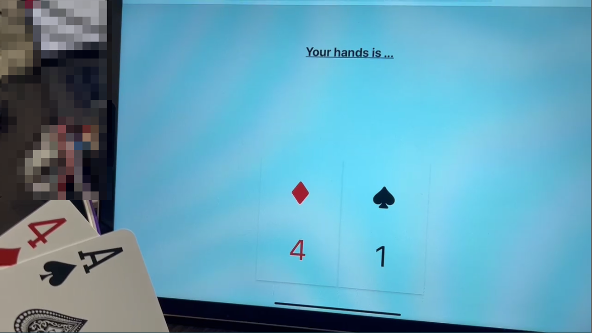

# playercards-from-nfc

This is a viewer for player cards that allows users to view player card information.

The application allows users to browse player cards, view details.



## Components

- API Server (Go wit libnfc)
  - `./cmd/cmd.go`
  - The Raspberry Pi connected to the NFC reader.
- Frontend (Next.js)
  - `./ui`

## How to run

### API Server

```bash
$ go build -o app ./cmd/cmd.go
$ sudo ./app
```

### Frontend

```bash
$ cd ui
$ npm install
$ npm run dev
```